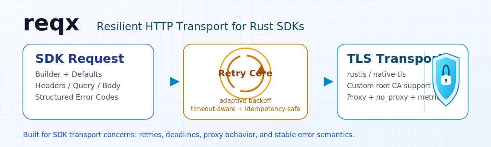

# reqx

[](https://crates.io/crates/reqx)
[](https://docs.rs/reqx)
[](https://github.com/lvillis/reqx-rs/actions/workflows/ci.yaml)
[](LICENSE)

<picture>
  <source media="(prefers-color-scheme: dark)" srcset="assets/reqx-banner-dark.svg">
  <source media="(prefers-color-scheme: light)" srcset="assets/reqx-banner-light.svg">
  
</picture>

`reqx` is an HTTP transport client for Rust API SDK libraries.

It focuses on SDK transport concerns: retries, timeout phases, idempotency, proxy routing, structured errors, and metrics.

## Install

```bash
cargo add reqx
```

Use `native-tls`:

```bash
cargo add reqx --no-default-features -F async-tls-native
```

Use `rustls + aws-lc-rs`:

```bash
cargo add reqx --no-default-features -F async-tls-rustls-aws-lc-rs
```

Use blocking client with `ureq + rustls(ring)`:

```bash
cargo add reqx --no-default-features -F blocking-tls-rustls-ring
```

Use blocking client with `ureq + native-tls`:

```bash
cargo add reqx --no-default-features -F blocking-tls-native
```

## TLS Backends

- async backends (default mode):
  - `async-tls-rustls-ring` (default)
  - `async-tls-rustls-aws-lc-rs`
  - `async-tls-native`
- blocking backends (`ureq`):
  - `blocking-tls-rustls-ring`
  - `blocking-tls-rustls-aws-lc-rs`
  - `blocking-tls-native`
- runtime selection via `tls_backend(TlsBackend::...)`
- build-time mismatch returns structured error from `try_build()`
- custom root CA: `tls_root_ca_pem(...)` / `tls_root_ca_der(...)`
- mTLS identity:
  - PEM chain + key: `tls_client_identity_pem(...)` (async + sync)
  - PKCS#12: `tls_client_identity_pkcs12(...)` (async `async-tls-native`)

## Quick Start

```rust
use std::time::Duration;

use reqx::prelude::{HttpClient, RetryPolicy};
use serde::Deserialize;

#[derive(Debug, Deserialize)]
struct CreateItemResponse {
    id: String,
}

#[tokio::main]
async fn main() -> Result<(), Box<dyn std::error::Error>> {
    let client = HttpClient::builder("https://api.example.com")
        .client_name("example-sdk")
        .request_timeout(Duration::from_secs(3))
        .total_timeout(Duration::from_secs(8))
        .retry_policy(
            RetryPolicy::standard()
                .max_attempts(3)
                .base_backoff(Duration::from_millis(100))
                .max_backoff(Duration::from_millis(800)),
        )
        .try_build()?;

    let created: CreateItemResponse = client
        .post("/v1/items")
        .idempotency_key("create-item-001")?
        .json(&serde_json::json!({ "name": "demo" }))?
        .send_json()
        .await?;

    println!("created id={}", created.id);
    Ok(())
}
```

## Blocking Quick Start

```rust
use std::time::Duration;

use reqx::blocking::HttpClient;

fn main() -> Result<(), Box<dyn std::error::Error>> {
    let client = HttpClient::builder("https://api.example.com")
        .request_timeout(Duration::from_secs(3))
        .total_timeout(Duration::from_secs(8))
        .build();

    let response = client.get("/v1/items").send()?;
    println!("status={}", response.status());
    Ok(())
}
```

## Core Capabilities

- global defaults + per-request overrides
- idempotency-aware retries
- bounded redirect following (`RedirectPolicy`)
- transport timeout + response-body timeout + total deadline
- separate connect timeout (`connect_timeout(...)`)
- streaming upload and streaming response path
- buffered-path automatic decoding: `gzip`, `br`, `deflate`, `zstd`
- proxy support with auth and `no_proxy`
- interceptor hooks for SDK concerns (`HttpInterceptor`)
- response body size limit
- structured error variants + machine error codes
- metrics snapshot for retries, latency, status and error buckets

## Examples

- Full index: `examples/README.md`
- `cargo run --example basic_json`
- `cargo run --example request_helpers`
- `cargo run --example request_overrides`
- `cargo run --example error_handling`
- `cargo run --example metrics_snapshot`
- `cargo run --example streaming`
- `cargo run --example concurrency_limits`
- `cargo run --example retry_classifier`
- `cargo run --example proxy_and_no_proxy`
- `cargo run --example tls_backends`
- `cargo run --example custom_ca_mtls`
- `cargo run --example interceptor_redirect`
- `cargo run --example blocking_basic --no-default-features -F blocking-tls-rustls-ring`

## Error Model

Common `HttpClientError` variants:

- `Transport { kind, .. }`
- `Timeout { phase, .. }`
- `DeadlineExceeded { .. }`
- `HttpStatus { status, body, .. }`
- `DecodeContentEncoding { .. }`
- `Deserialize { .. }`

Use `error.code()` for stable machine-readable classification.
